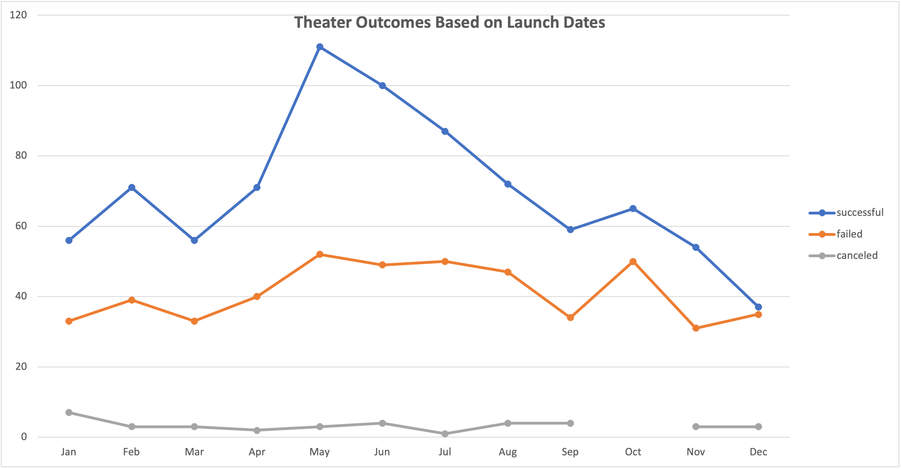
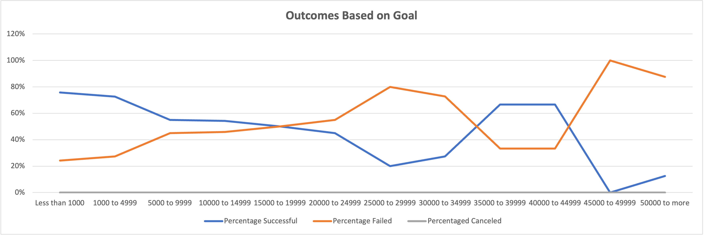

# Kickstarter Campaigns Analysis.

## Overview of Project

The overview of the project is to find through an extensive analysis, what result each theater campaign obtained, based on launch date and cost.

To carry out this analysis, we have used pivot tables and charts that have helped us understand which campaigns were most successful according to the month and which ones Louise should not focus on.

## Analysis and Challenges

### Analysis of Outcomes Based on Launch Date

In this analysis we have used a pivot table based on the successful, failed or cancelled results for each month of the year.

According to the results, we can say that there was some activity in the first months of the year, but it was not until May when the line to launch successful campaigns skyrocketed. May, June and even July were the best performing months of the year.
On the other hand, we can see that from August towards the end of the year there was a big decrease in results compared to the previous months and the numbers of successful and failed campaigns were similar.
Our graph shows that there were no cancelled theatre campaigns throughout the year.

## Analysis of Outcomes Based on Goals

The graph shows a strong correlation between the size of the project budget and the percentage of successful, failed or canceled campaigns with a budget of less than 10k

As a result, we can see that the most successful campaigns are those that had a fund of up to 10k. However, we do not have precise information about the results, since campaigns with a budget greater than 20k have such small numbers that it makes the analysis unreliable.

We cannot conclude that the result of campaigns with a budget of more than 45k has been unsuccessful based in one play only, therefore this information is inconsistent.

### Challenges and Difficulties Encountered

The challenges encountered in this analysis are the lack of consistent data and information. The results are very general because everything is based only on month and budget.
For better results, we can add the filter by year and based on that, see if theater campaigns were successful or if they failed.
Also, to know exactly what budget to use, it is better to take into account only the projects with the more theatrical campaigns and thus we will not have inaccurate information in our result.

## Results

- What are two conclusions you can draw about the Outcomes based on Launch Date?

1.	I can conclude that there is a high level of acceptance to launch campaigns in the months of May, June and July.
2.	Campaign launches should not be carried out between January to April and August to December, since those are months with less acceptance

- What can you conclude about the Outcomes based on Goals?

1.	To successfully reach the goal, the focus should be on low budget campaigns
2.	In order to avoid imprecise results, we must take into account the projects with more campaigns, whether they are successful, failed or cancelled.

- What are some limitations of this dataset?

There are not enough data points collected for this analysis, for that reason the data obtained from our chart and pivot table show us that the analysis does not represent reliable data.

- What are some other possible tables and/or graphs that we could create?

We can have more accurate results by changing or adding filters. In the pivot table we can filter the information by year and add the country to the filter as well. Likewise, we can base the conclusion only on low-budget projects and this would greatly change the dynamics of the results. 
Results can also be displayed as a pie chart or columns.